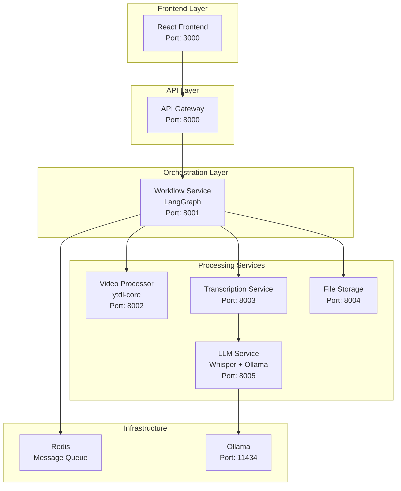

# YouTube Transcriber - Complete Architecture & Implementation Plan

## 🎯 Project Overview
A microservice-based YouTube video transcription application with:
- **Frontend**: React web app with YouTube URL input and video display
- **Backend**: Node.js microservices with TypeScript
- **AI Processing**: Local Whisper + Ollama for transcription and text enhancement
- **Orchestration**: LangGraph for workflow management
- **Deployment**: Containerized for AWS deployment

## 🏗️ System Architecture



## 📁 Project Structure

```
youtube-transcriber/
├── services/
│   ├── frontend-service/           # React Web App
│   │   ├── src/
│   │   │   ├── components/
│   │   │   │   ├── VideoInput.tsx
│   │   │   │   ├── VideoPlayer.tsx
│   │   │   │   ├── TranscriptionDisplay.tsx
│   │   │   │   └── ProcessingStatus.tsx
│   │   │   ├── services/api.ts
│   │   │   ├── hooks/useTranscription.ts
│   │   │   └── App.tsx
│   │   ├── package.json
│   │   └── Dockerfile
│   │
│   ├── api-gateway/                # Request Routing & Rate Limiting
│   │   ├── src/
│   │   │   ├── routes/transcription.ts
│   │   │   ├── middleware/
│   │   │   └── server.ts
│   │   └── Dockerfile
│   │
│   ├── workflow-service/           # LangGraph Orchestration
│   │   ├── src/
│   │   │   ├── graphs/TranscriptionWorkflow.ts
│   │   │   ├── nodes/ (ValidateUrl, ExtractAudio, Transcribe, etc.)
│   │   │   ├── state/ProcessingState.ts
│   │   │   └── server.ts
│   │   └── Dockerfile
│   │
│   ├── video-processor-service/    # YouTube Processing
│   │   ├── src/
│   │   │   ├── services/
│   │   │   │   ├── YouTubeDownloader.ts
│   │   │   │   ├── AudioExtractor.ts
│   │   │   │   └── MetadataExtractor.ts
│   │   │   └── server.ts
│   │   └── Dockerfile
│   │
│   ├── transcription-service/      # Transcription Coordination
│   │   ├── src/
│   │   │   ├── controllers/TranscriptionController.ts
│   │   │   └── server.ts
│   │   └── Dockerfile
│   │
│   ├── llm-service/               # Whisper + Ollama
│   │   ├── src/
│   │   │   ├── services/
│   │   │   │   ├── WhisperService.ts
│   │   │   │   ├── OllamaService.ts
│   │   │   │   └── ModelManager.ts
│   │   │   └── server.ts
│   │   ├── scripts/setup-ollama.sh
│   │   └── Dockerfile
│   │
│   └── file-storage-service/      # File Management
│       ├── src/
│       │   ├── services/
│       │   │   ├── LocalStorage.ts
│       │   │   └── S3Storage.ts
│       │   └── server.ts
│       └── Dockerfile
│
├── shared/                        # Common Types & Utils
│   ├── types/ (transcription.ts, workflow.ts, api.ts)
│   └── utils/ (validation.ts, logger.ts)
│
├── infrastructure/                # Deployment
│   ├── docker-compose.yml
│   ├── docker-compose.prod.yml
│   └── k8s/ (Kubernetes manifests)
│
└── scripts/ (setup, build, deploy)
```

## 🔧 Technology Stack

### Core Technologies
- **Frontend**: React 18 + TypeScript + Vite + Tailwind CSS
- **Backend**: Node.js 18 + TypeScript + Express.js
- **Orchestration**: LangGraph for workflow management
- **AI Processing**: Whisper.cpp + Ollama (local LLM)
- **Video Processing**: ytdl-core for YouTube handling
- **Message Queue**: Redis
- **Containerization**: Docker + Docker Compose
- **Deployment**: AWS ECS/EKS

### Key Dependencies
```json
{
  "langraph": "@langchain/langgraph",
  "youtube": "ytdl-core", 
  "transcription": "whisper.cpp + ollama",
  "storage": "redis + local/s3",
  "api": "express + axios"
}
```

## 🔄 Processing Workflow

### LangGraph Workflow Steps
1. **URL Validation**: Validate YouTube URL format and accessibility
2. **Metadata Extraction**: Get video title, duration, thumbnail
3. **Audio Download**: Extract audio using ytdl-core
4. **Whisper Transcription**: Convert audio to text with timestamps
5. **Ollama Enhancement**: Improve text quality, add punctuation
6. **Summary Generation**: Create summary and extract keywords
7. **Cleanup**: Remove temporary files
8. **Result Delivery**: Return enhanced transcription

### Processing State Schema
```typescript
interface ProcessingState {
  jobId: string;
  youtubeUrl: string;
  status: 'pending' | 'processing' | 'completed' | 'failed';
  progress: number;
  currentStep: string;
  videoMetadata?: VideoMetadata;
  audioFileId?: string;
  rawTranscription?: string;
  enhancedTranscription?: string;
  summary?: string;
  keywords?: string[];
  error?: string;
  timestamps: Array<{start: number, end: number, text: string}>;
}
```

## 🚀 Implementation Plan (6 Weeks)

### Phase 1: Foundation (Week 1)
- Project structure setup
- Basic Docker configuration
- API Gateway with routing
- File Storage Service
- React frontend foundation

### Phase 2: Video Processing (Week 2)
- Video Processor Service with ytdl-core
- Audio extraction functionality
- File management and cleanup
- Integration testing

### Phase 3: LLM Integration (Week 3)
- Whisper.cpp setup for transcription
- Ollama configuration for text enhancement
- Model management system
- Performance optimization

### Phase 4: Workflow Orchestration (Week 4)
- LangGraph workflow implementation
- All processing nodes
- State management and persistence
- Error recovery mechanisms

### Phase 5: Frontend Enhancement (Week 5)
- Complete UI components
- Real-time status updates
- Transcription display with timestamps
- Export functionality

### Phase 6: Production Deployment (Week 6)
- Container optimization
- AWS ECS/EKS setup
- Monitoring and logging
- Performance tuning

## 📊 API Design

### Main Endpoints
```typescript
POST /api/transcribe              # Start transcription job
GET  /api/transcribe/:jobId       # Get job status  
GET  /api/transcribe/:jobId/result # Get transcription result
POST /api/transcribe/:jobId/cancel # Cancel job
GET  /api/video-info?url=...      # Get video metadata
```

### Service Communication
- **HTTP REST**: Request/response between services
- **Redis**: Async message queuing and caching
- **LangGraph**: Workflow state management

## 🐳 Containerization Strategy

### Docker Compose Services
- **frontend**: React app (port 3000)
- **api-gateway**: Express gateway (port 8000)  
- **workflow-service**: LangGraph orchestrator (port 8001)
- **video-processor**: YouTube processing (port 8002)
- **transcription**: Transcription coordination (port 8003)
- **file-storage**: File management (port 8004)
- **llm-service**: Whisper + Ollama (ports 8005, 11434)
- **redis**: Message queue (port 6379)

### Resource Requirements
- **LLM Service**: 4-8GB RAM, 2-4 CPU cores
- **Other Services**: 1-2GB RAM, 1 CPU core each
- **Storage**: Persistent volumes for models and temp files

## 🎯 Success Metrics

### Performance Targets
- Video Processing: < 30 seconds for 10-minute video
- Transcription: < 2x video length processing time
- API Response: < 200ms for status checks
- UI Loading: < 3 seconds initial load

### Quality Targets
- Transcription Accuracy: > 95% for clear audio
- System Uptime: > 99.5% availability
- Error Rate: < 1% failed transcriptions
- User Experience: Intuitive, responsive interface

## 🔒 Security & Best Practices

### Security Measures
- Input validation for YouTube URLs
- Rate limiting on API endpoints
- CORS configuration
- Environment variable management
- Temporary file cleanup
- Container security hardening

### Monitoring & Logging
- Health check endpoints for all services
- Centralized logging with structured logs
- Performance metrics collection
- Error tracking and alerting
- Resource usage monitoring

## 🌟 Key Features

### Core Functionality
- YouTube URL input with validation
- Embedded video player
- Real-time transcription processing
- Enhanced text with proper formatting
- Automatic summarization
- Keyword extraction
- Timestamped segments
- Export capabilities

### Advanced Features
- Progress tracking with detailed status
- Error handling and recovery
- Cancellation support
- Multiple model options
- Batch processing capability
- Search within transcriptions
- Multi-language support (future)

## 🏠 Local Development & Testing

### One-Command Startup
```bash
# Clone and start entire system locally
git clone <repo>
cd youtube-transcriber
docker-compose up
```

### Local Access Points
- **Frontend**: http://localhost:3000 (React app)
- **API Gateway**: http://localhost:8000 (All API endpoints)
- **Individual Services**: Ports 8001-8005 for direct testing
- **Ollama**: http://localhost:11434 (Direct LLM access)
- **Redis**: localhost:6379 (Message queue)

### System Requirements
#### Minimum Local Requirements
- **RAM**: 8GB (4GB for Ollama + 4GB for other services)
- **CPU**: 4 cores (2 for Ollama, 2 for other services)
- **Storage**: 10GB (models + temporary files)
- **Docker**: Docker Desktop with 6GB memory allocation

#### Recommended for Smooth Development
- **RAM**: 16GB
- **CPU**: 8 cores
- **Storage**: 20GB SSD
- **GPU**: Optional but improves Ollama performance

### Development Workflow
```bash
# Start all services
npm run dev

# Start individual service in dev mode
cd services/frontend-service
npm run dev  # Vite hot reload

# Run tests
npm run test
npm run test:watch

# View service logs
docker-compose logs -f workflow-service

# Clean up
docker-compose down -v
```

### Local Testing Strategy
1. **Unit Testing**: Each service has its own test suite
2. **Integration Testing**: Docker Compose test environment
3. **Manual Testing**: Full workflow testing via frontend
4. **Service Health Checks**: Individual service endpoints
5. **State Inspection**: Redis CLI for debugging workflow state

### Expected Local Performance
- **Startup Time**: ~2-3 minutes (first time with model downloads)
- **Subsequent Starts**: ~30 seconds
- **5-minute Video**: ~3-5 minutes processing time
- **Memory Usage**: ~6-8GB total across all services

### Development Tools Integration
- VS Code configuration for debugging
- Environment variables for local development
- Hot reload for rapid iteration
- Direct service access for testing
- Comprehensive logging and monitoring

This architecture provides a scalable, maintainable, and feature-rich YouTube transcription service using modern microservice patterns with local AI processing capabilities, fully testable and developable on local machines.
